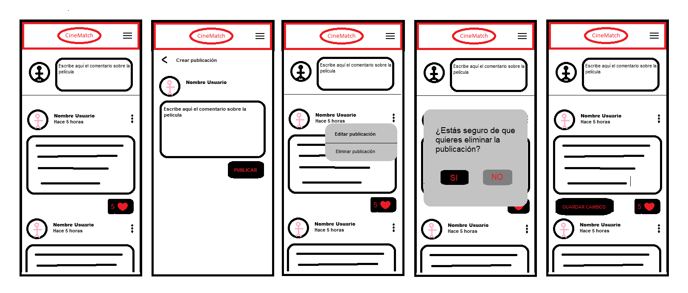
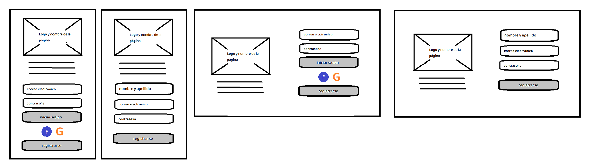
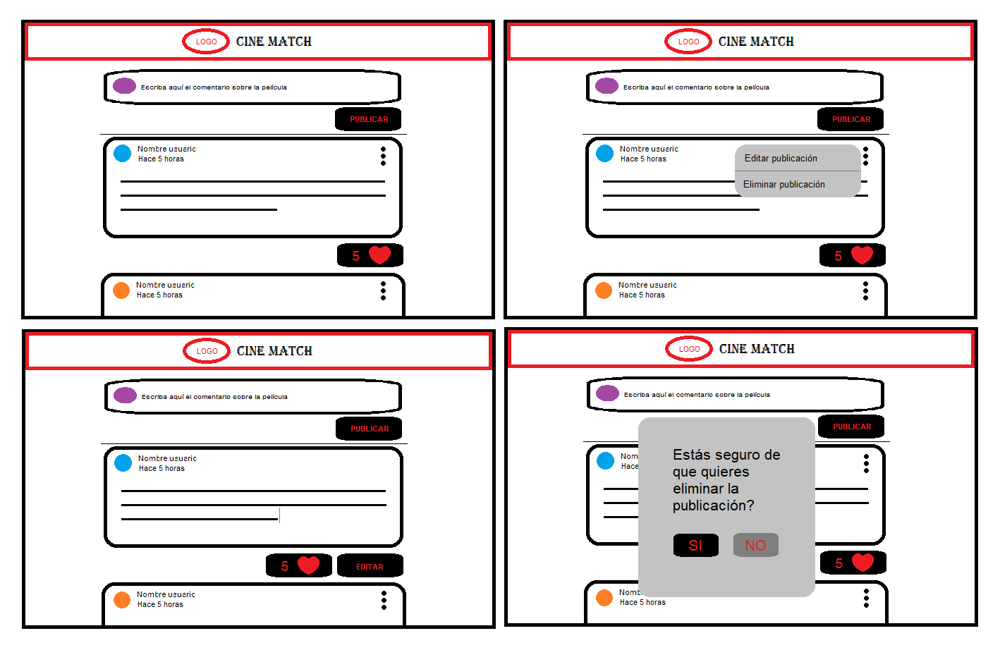
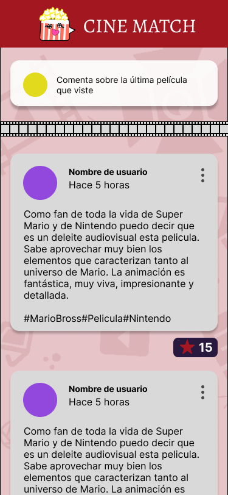
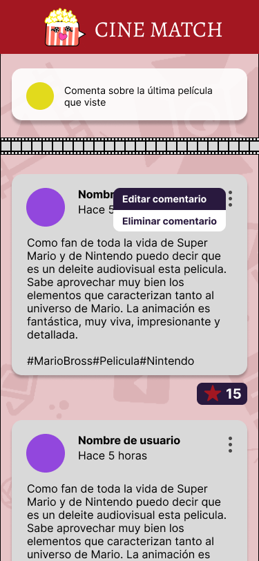
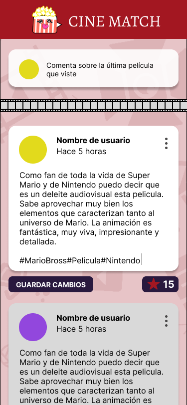

# Creando una Red Social

## Índice

* [1. Preámbulo](#1-preámbulo)
* [2. Proyecto CineMatch](#2-proyecto-cinematch)
* [3. Historias de Usuario](#3-historias-de-usuario)
* [4. Prototipos](#4-prototipos)
* [5. Test de usabilidad](#5-tes-de-usabilidad)
* [6. Participantes](#5-participantes)

## 1. Preámbulo

Instagram, Snapchat, Twitter, Facebook, Twitch, Linkedin, etc. Las redes
sociales han invadido nuestras vidas. Las amamos u odiamos, y muchos no podemos
vivir sin ellas.

Hay redes sociales de todo tipo y para todo tipo de intereses. Por ejemplo,
en una ronda de financiamiento con inversionistas, se presentó una red social
para químicos en la que los usuarios podían publicar artículos sobre sus
investigaciones, comentar en los artículos de sus colegas, y filtrar artículos
de acuerdo a determinadas etiquetas o su popularidad, lo más reciente, o lo
más comentado.

## 2. Proyecto CineMatch

El presente proyecto está basado en construir una red social, donde los usuarios pueden compartir sus apreciaciones sobre las películas que ha observado y sean de su interés. 

En esta Red Social el usuario puede iniciar sesión registrándose o con una cuenta de google. Una vez iniciada la sesión, puede escribir su comentario, editar, borrar y dar like a los comentarios, tanto propios como los de otros usuarios.

Esta interfaz se puede usar desde cualquier dispositivo.

## 3. Historias de Usuario

- HU1 Yo como usuario de CINEMATCH quiero registrarme en la aplicación para poder visualizar las recomendaciones de otros usuarios.
- HU2 Yo como usuario de CINEMATCH quiero iniciar sesión con mi cuenta de google para evitar registarme
- HU3 Yo como usuario de CINEMATCH quiero poder iniciar sesión con correo y contraseña ya resgistrados para tener acceso a la aplicación y poder interactuar
- HU4 Yo como usuario de CINEMATCH quiero crear un post  o recomendación de una pelicular para poder interactuar con otros usuarios.
- HU5 Yo como usuario de CINEMATCH quiero poder editar un post que he publicado, para corregir mi publicación.
- HU6 Yo como usuario de CINEMATCH quiero poder eliminar el post que acabo de hacer para no generar spam de la misma película.
- HU7 Yo como usuario de CINEMATCH quiero poder darle like al post  para poder recomendar peliculas de mi preferencia.

## 4. Prototipos
- Prototipos de en baja fidelidad

- Prototipos de en alta fidelidad

## 6. Test de usabilidad

- Modificamos el fondo de la interfaz de register y login.
- Pusimos transparencia en la parte de atrás de los input.
- Se agregaron labels.
- Se cambió el color de las letras de los labels.
- En los botones secundarios se intercabió los colores.
- Se cambió a minúscula los textos de los botones.

## 5. Participantes
- [Laura Montero](https://github.com/LauraCMonteroM)
- [Martha Ayala](https://github.com/mmayala)
- [Mariel Figueroa](https://github.com/marielfico)

